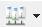
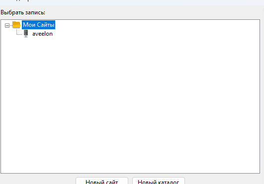
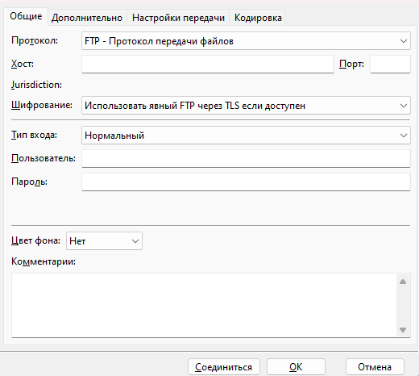
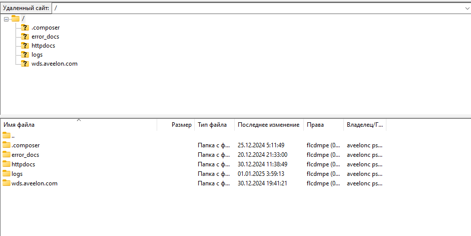
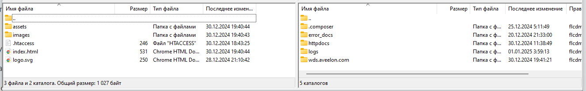
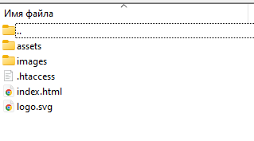
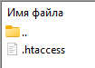

## **Техническая документация проекта [[Aveelon]{.underline}](https://wds.aveelon.com/)**

## **Обзор проекта**

**Aveelon** --- это веб-приложение, представляющее собой сайт компании,
занимающейся разработкой бизнес-продуктов, а также широкий спектр услуг
для бизнеса. Сайт Aveelon демонстрирует it-услуги компании, портфолио
проектов и маркетинговые услуги, а также список тех-стек предоставляемых
услуг. Сайт полностью адаптивный и поддерживает три языка ---
английский, русский и казахский, что позволяет эффективно обслуживать
клиентов в разных странах и регионах.

**Основные страницы:**

- **Главная страница** --- общая информация о компании и ее ключевых

  > направлениях.

- **IT-услуги** --- описание предоставляемых решений для бизнеса.

- **Маркетинг** --- раздел, посвященный стратегиям продвижения

  > продуктов и услуг.

- **Портфолио** --- демонстрация успешных проектов компании с

  > возможностью фильтрации по категориям.

- **Страница проектов** --- подробная информация о реализованных
  > проектах, их технологиях и результатах, а также возможностью
  > перехода на сайт проекта.

## **Основной стек технологий**:

- **React** основная библиотека для разработки SPA-приложения

- **TypeScript** для строгой типизации

- **React Router v6** для маршрутизации

- **Styled components** - библиотека для стилизации компонентов

- **i18next** был использован для мультиязычности

- **Vite** для сборщики проекта

- **eslint**, **prettier**, **clsx** и др. библиотеки и плагины для
  > упрощения разработки

## **Установка**

Для запуска проекта необходимо иметь установленный
[[Node.js]{.underline}](https://nodejs.org/) и
[[npm]{.underline}](https://www.npmjs.com/).

### Шаги для установки

1.  Перейдите в директорию проекта:\

    > cd aveelon

2.  Установите зависимости:\

    > npm install

3.  Для запуска приложения есть 2 варианта:

    a. Для запуска приложения в режиме разработки используйте команду:\

    > npm run dev

    b. Также вы можете запустить собранный билд проекта командой:\

    > npx serve -s dist

## **Архитектура проекта**

### Описание основных папок и компонентов:

- **assets** --- папка предназначена для статичных картинок и шрифтов

  - images: здесь расположены статичные картинки.

- **components** --- содержит папки и пере используемые компоненты:

  - icons: в этой папке хранится все иконки-компоненты.

  - StackShowcase: в этой папке хранится виджет презентация стека

  - Tab: в этой папке хранится виджет табов.

  - Card: компонент карточки.

  - Text: текстовый компонент.

  - \... и тд.

- **context** --- Базовый стейт менеджер проекта для управления

  > проектами и шириной экрана

- **data** --- хранит типизированные данные, и проекты для всего

  > приложения.

  - projects: в этой папке хранится проекты по категориям.

- **hooks** --- страницы с реакт-хуками

- **layouts** --- содержит слой для страниц: header (шапка) и footer

  > (подвал).

- **pages** --- страницы приложения, такие как:

  - MainPage: главная страница.

  - ServicesPage: страница it-услуг.

  - MarketingPage: страница маркетинга.

  - PortfolioPage: портфолио.

  - ProjectPage: страница выбранного продукта из списка портфолио.

- **routes**--- содержит маршрутизацию приложения и его логику.

- **styles**--- глобальные стили и настройка темы для

  > _styled-components_:

- **utils**--- папка для перевода и вспомогательных утилит:

### Реэкспорт и алиасы:

- **Реэкспорт**: для удобства и улучшения структуры проекта

  > используется реэкспорт компонентов и модулей. Например, общие
  > компоненты из папки components реэкспортируются через индексные
  > файлы, чтобы сократить и упростить импорт в других частях
  > приложения.

- **Алиасы импортов**: настроены алиасы для более удобного импорта
  > модулей из различных частей проекта. В файле tsconfig.app.json и
  > vite.config.js определены алиасы, которые позволяют импортировать
  > компоненты без использования относительных путей.

### **Инструкция по деплою сайта**

1.  Скачиваем

    > [[Filezilla]{.underline}](https://filezilla-project.org/download.php?type=client)
    > по ссылке и устанавливаем

2.  Открываем программу и переходим \*\*Файл -\> Менеджер сайтов (ctrl +

    > s)\*\*{width="0.324073709536308in"
    > height="0.20833333333333334in"}

3.  В открывшимся окне нажимаем кнопку Новый сайт, называем сайт

    > (aveelon или любое другое)\
    > {width="5.53125in"
    > height="3.8645833333333335in"}

4.  Потом в правом окне во вкладке Общие указываем Хост, логин и пароль.

    > Нажимаем соединиться и ок.\
    > {width="4.869792213473316in"
    > height="4.342489063867017in"}

5.  Затем появится каталог папок и файлов на сервере. На этом этапе нам

    > нужно перенести файлы проекта на сервер\
    > {width="6.00094050743657in"
    > height="3.000470253718285in"}\
    > 5.1. На левом окне открываем наш проект из архива и переходим в
    > папку dist\
    > {width="6.267716535433071in"
    > height="0.9861111111111112in"}\
    > таким образом на левом окне наши локальные файлы и папки, а на
    > правом на сервере\
    > \
    > 5.2 В папке httpdocs мы храним htaccess конфиг. в папке
    > wds.aveelon.com - само приложение. Перед 6 пунктом открываем выше
    > перечисленные папки и удаляем все что находиться внутри

6.  с левого окна перетаскиваем все содержимое проекта в папку
    > web.aveelon.com и дополнительно перемещаем файл .htaccess в папку
    > httpdocs. Результат должен быть таким\
    > \
    > папка wds.aveelon.com\
    > {width="3.1614588801399823in"
    > height="1.7541633858267716in"}\
    > папка httpdocs{width="1.09375in"
    > height="0.78125in"}
